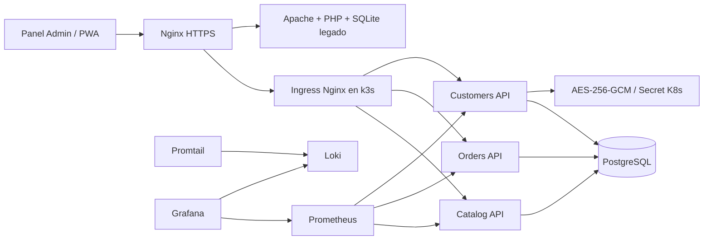
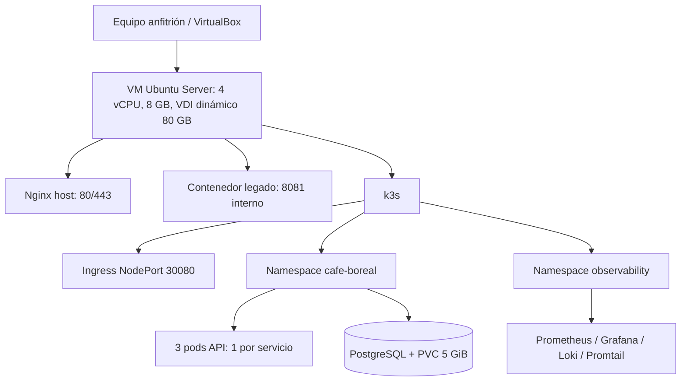

# Arquitectura y despliegue

## Diagrama lógico

## Despliegue físico

Nginx es el único frontal público dentro de la VM y obliga HTTPS. El Ingress mantiene el enrutamiento Kubernetes. El legado permanece aislado en loopback y solo se alcanza mediante Nginx.

Prometheus obtiene las métricas de contenedores desde el endpoint cAdvisor integrado en el kubelet de k3s y las métricas HTTP desde `/metrics` de cada API mediante un `ServiceMonitor`.
